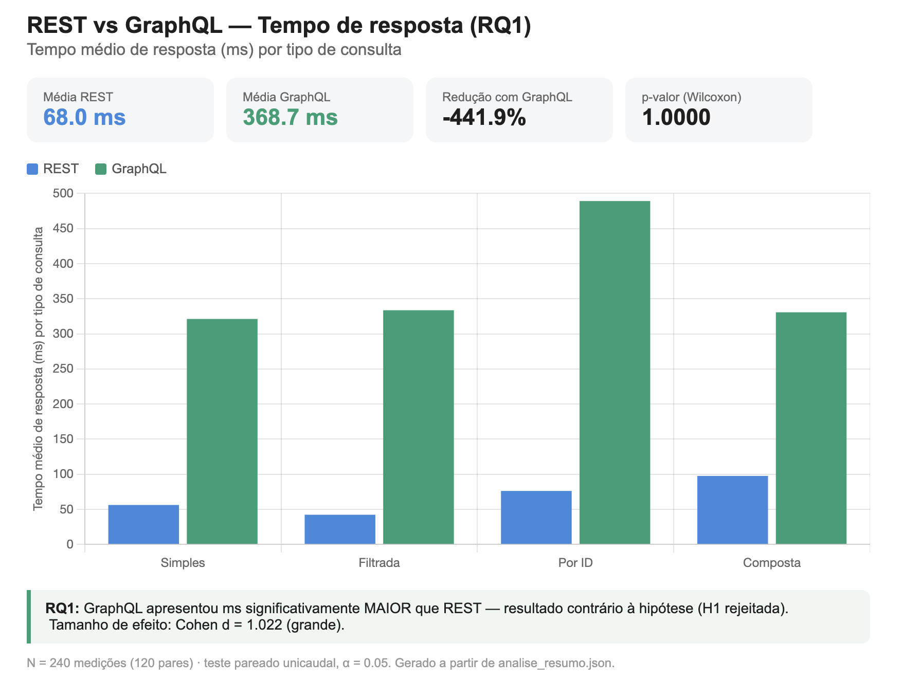
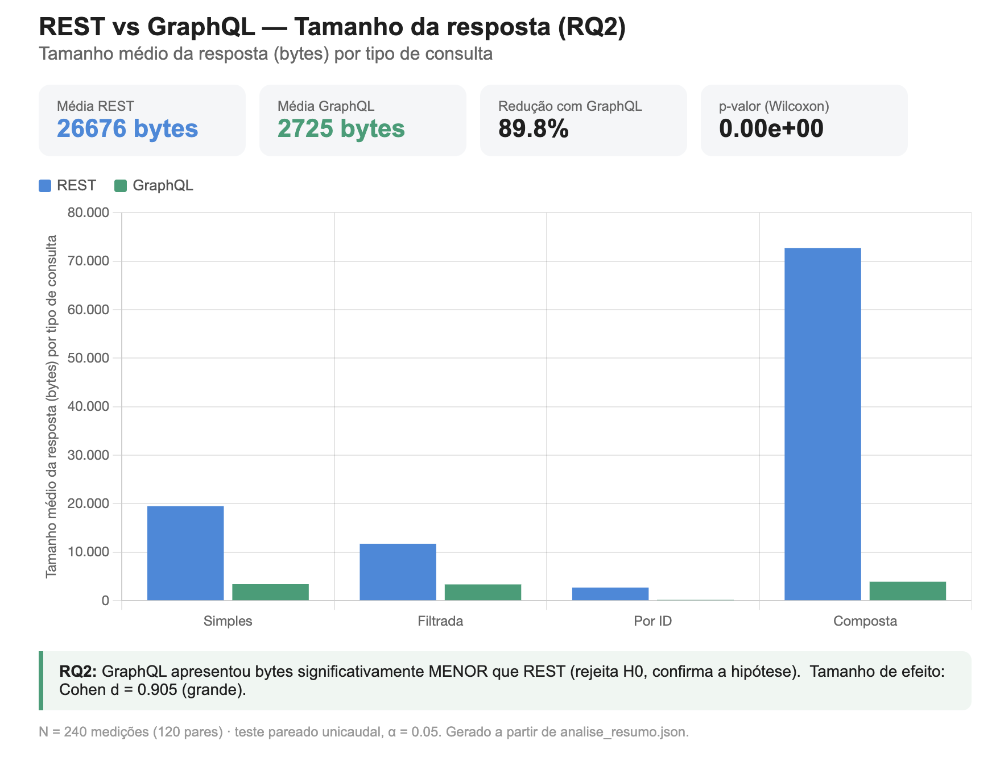

# Lab05 — Desenho e Preparação do Experimento

## GraphQL vs REST — Um experimento controlado

**Aluno:** Pedro Lucas Sousa e Silva

> Este documento descreve o **desenho** (Sprint 1) e a **preparação** do experimento,
> já alinhado com o que foi efetivamente utilizado na execução. A execução, a análise
> estatística e a discussão dos resultados estão em [`RELATORIO_FINAL.md`](RELATORIO_FINAL.md).

---

## 1. Desenho do Experimento

### A. Hipóteses

**Hipótese nula (H0):** Não existe diferença significativa no tempo de resposta nem no tamanho das respostas entre consultas GraphQL e REST.

**Hipótese alternativa (H1):** Consultas GraphQL apresentam tempo de resposta menor e tamanho das respostas menor quando comparadas às consultas REST.

> Observação: por H1 ser unicaudal ("menor"), os testes estatísticos foram aplicados na forma *one-sided* (t pareado e Wilcoxon unicaudal).
>
> **Resultado (resumo):** a hipótese se **confirmou para o tamanho** (GraphQL ~90% menor) e foi **refutada para o tempo** (GraphQL ficou mais lento que REST). Detalhes no relatório final.

### B. Variáveis Dependentes

São as métricas medidas:

- Tempo de resposta (ms)
- Tamanho da resposta (bytes)

### C. Variáveis Independentes

Fatores manipulados no experimento:

- Tipo de API: REST vs GraphQL
- Tipo de consulta: simples, filtrada, por ID e composta

### D. Tratamentos

- **T1 — REST:** consultas executadas usando endpoints REST tradicionais.
- **T2 — GraphQL:** as mesmas consultas executadas usando sintaxe GraphQL equivalente.

### E. Objetos Experimentais

Foi utilizada a **API pública do Rick and Morty**, que oferece as duas abordagens sobre os mesmos dados e **não exige token/autenticação**:

- REST: `https://rickandmortyapi.com/api`
- GraphQL: `https://rickandmortyapi.com/graphql`

Sobre ela são feitas 4 consultas equivalentes:

- consulta simples — lista de personagens;
- consulta filtrada — personagens com `name=rick`;
- consulta por ID — um personagem específico;
- consulta composta — personagem + episódios relacionados.

### F. Tipo de Projeto Experimental

Projeto controlado com **medidas repetidas (within-subject / pareado)**, pois:

- os mesmos objetos são testados em REST e em GraphQL;
- o mesmo ambiente é usado para evitar ruído externo;
- a comparação é direta entre tratamentos (pareada por consulta e repetição).

### G. Quantidade de Medições

Para cada consulta:

- 30 medições em REST;
- 30 medições em GraphQL (+ 1 repetição de *warm-up* descartada por consulta).

**Total:** 4 consultas × 30 repetições × 2 tratamentos = **240 medições** (120 pares).

### H. Ameaças à Validade

**Validade interna**

- Oscilações de rede podem afetar tempos → mesmo computador e rede; repetições e uso da mediana.
- **Cache de CDN (observado):** as respostas REST (`GET`) são servidas do cache de borda do CDN (Cloudflare) e voltam muito rápidas, enquanto o GraphQL (`POST`) **não é cacheável** e sempre atinge o servidor de origem. Isso favorece o REST no tempo. Mitigação parcial: cabeçalho `Cache-Control: no-cache` e *warm-up*; o efeito é registrado como limitação e discutido no relatório.

**Validade externa**

- Uso de apenas um domínio (Rick and Morty) → os resultados podem não generalizar para outras APIs. Limitação assumida.

**Validade de construção**

- REST e GraphQL solicitam o mesmo conjunto de campos úteis. O REST, porém, retorna campos extras (*over-fetching*), o que faz parte do fenômeno estudado e explica boa parte da diferença de tamanho.
- Tempo medido como latência fim-a-fim da requisição bem-sucedida (as esperas de retentativa por *rate limit* são excluídas da medição).

**Validade estatística / de conclusão**

- 30 repetições por consulta mitigam ruído; além do p-valor, reporta-se o tamanho de efeito (Cohen *d* e *r*). Como a normalidade não é assumida, aplicam-se dois testes (t pareado e Wilcoxon).

---

## 2. Preparação do Experimento

### 2.1 Ambiente

- Computador pessoal (macOS — MacBook Air).
- **Python 3.14** como linguagem principal.
- Bibliotecas:
  - `requests` — chamadas REST (`GET`) e GraphQL (`POST`), com sessão *keep-alive* e retentativas com *backoff* (429-aware);
  - `pandas` e `numpy` — manipulação e análise dos dados;
  - `csv` e `time.perf_counter` (biblioteca padrão) — gravação e medição de tempo de alta precisão.
- **Testes estatísticos:** t de Student pareado e Wilcoxon dos postos sinalizados **implementados em Python puro** (sem `scipy`), para o script rodar em qualquer ambiente.
- **Visualização:** gráficos HTML interativos com **Chart.js** (via CDN).

> Decisão de ferramenta: optou-se por **Python + `requests`** por integração direta com pandas/numpy na análise, mantendo todo o pipeline (coleta → análise → gráficos) em uma só linguagem.

### 2.2 Scripts

| Arquivo | Função |
|---------|--------|
| `experimento.py` | Coleta real na API do Rick and Morty; mede tempo e tamanho; salva `resultados.csv`. |
| `gerar_dados.py` | Gera um `resultados.csv` **simulado** (fallback para testar a pipeline sem coletar). |
| `analise.py` | Estatística pareada (t + Wilcoxon), tamanho de efeito; gera `analise_resumo.json`. |
| `gerar_graficos.py` | Gera os 2 gráficos HTML em `graficos/` (tempo e tamanho). |

Ordem de execução:

```bash
pip install -r requirements.txt
python3 experimento.py        # coleta os dados reais
python3 analise.py            # roda a estatística
python3 gerar_graficos.py     # gera os gráficos
```

### 2.3 Consultas

As 4 consultas, equivalentes em REST e GraphQL:

| # | Consulta | REST | GraphQL |
|---|----------|------|---------|
| 1 | Simples | `GET /character` | `characters { results { … } }` |
| 2 | Filtrada | `GET /character/?name=rick` | `characters(filter:{name:"rick"})` |
| 3 | Por ID | `GET /character/1` | `character(id:1)` |
| 4 | Composta | `GET /character/1` + `GET /episode/1,2,…` (lote) | `character(id:1){ … episode{…} }` |

### 2.4 Estrutura do CSV

Cada linha registrada segue o formato:

| metodo | consulta | repeticao | tempo_ms | tamanho_bytes |
|--------|----------|-----------|----------|---------------|
| REST | simples | 1 | 56.2 | 19496 |
| GraphQL | simples | 1 | 321.2 | 3421 |

Isso permite as análises diretas para RQ1 (tempo) e RQ2 (tamanho).


